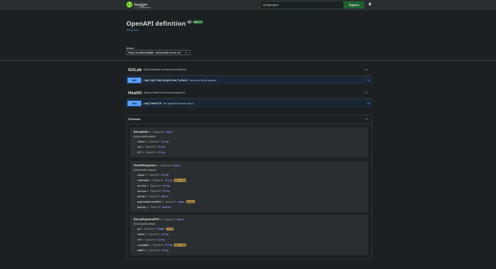

# Pipeline Health API

## Overview

Pipeline Health API is a backend microservice designed to monitor GitLab CI/CD pipelines.

It provides aggregated metrics such as pipeline success rate and system health status to help DevOps teams improve delivery reliability.

---

## Features

- Retrieve latest GitLab pipeline information
- Compute pipeline success rate
- Expose health monitoring REST endpoints
- Scheduled cache refresh for performance optimization
- Retry mechanism for external API resilience

---

## Tech Stack


---

## CI/CD


- Automated build on push
- Maven compilation
- Test execution
- Pipeline validation

---
## Architecture

The application follows a layered architecture:

Controller → Service → Client → External API (GitLab)

Scheduler → Cached Health State

---
## API Endpoints

### Health

**GET** `/api/health`

- Returns the global application health status, including GitLab pipeline state and success rate.

#### Example Response

```json
{
  "status": "UP",
  "timestamp": "2026-05-06T11:10:18.071609106Z",
  "service": "pipeline-health-api",
  "version": "1.0.0",
  "gitlab": {
    "status": "success",
    "ref": "main",
    "url": "https://gitlab.com/mehdi-zayani/pipeline-health-tests/-/pipelines/2491956212"
  },
  "healthy": true,
  "pipelineSuccessRate": 100.0
}
```
---

### GitLab Pipeline

**GET** `/api/gitlab/pipeline/latest`

- Returns the most recent pipeline executed on the configured GitLab project.

#### Example Response

```json
{
  "id": 2491956212,
  "status": "success",
  "ref": "main",
  "createdAt": "2026-04-30T16:41:14.588Z",
  "webUrl": "https://gitlab.com/mehdi-zayani/pipeline-health-tests/-/pipelines/2491956212"
}
```
---
## API Documentation

The API is documented using OpenAPI 3 (SpringDoc).

Swagger UI:
```http request
http://localhost:8080/swagger-ui.html
```
### Swagger UI


----

## Actuator Monitoring

Spring Boot Actuator is enabled to expose runtime application metrics and health information.

---

### Health Endpoint

**GET** `/actuator/health`

Returns detailed application health including system components.

#### Example Response

```json
{
  "status": "UP",
  "components": {
    "db": {
      "status": "UP",
      "details": {
        "database": "H2",
        "validationQuery": "isValid()"
      }
    },
    "diskSpace": {
      "status": "UP",
      "details": {
        "total": 85037703168,
        "free": 73208684544,
        "threshold": 10485760,
        "path": "/home/msz/workspace/03-devops/pipeline-health-api/.",
        "exists": true
      }
    },
    "ping": {
      "status": "UP"
    },
    "ssl": {
      "status": "UP",
      "details": {
        "validChains": [],
        "invalidChains": []
      }
    }
  }
}
```
---

### Info Endpoint

**GET** `/actuator/info`

Returns application metadata such as name, version, and description.

#### Example Response

```json
{
  "app": {
    "name": "pipeline-health-api",
    "version": "1.0.0",
    "description": "Health monitoring API with GitLab integration"
  }
}
```
---
### Metrics Endpoint

**GET** `/actuator/metrics/jvm.memory.used`

Provides JVM memory usage metrics.

#### Example Response

```json
{
  "name": "jvm.memory.used",
  "description": "The amount of used memory",
  "baseUnit": "bytes",
  "measurements": [
    {
      "statistic": "VALUE",
      "value": 1.40379184E8
    }
  ],
  "availableTags": [
    {
      "tag": "area",
      "values": ["heap", "nonheap"]
    },
    {
      "tag": "id",
      "values": [
        "G1 Survivor Space",
        "Compressed Class Space",
        "Metaspace",
        "CodeCache",
        "G1 Old Gen",
        "G1 Eden Space"
      ]
    }
  ]
}
```
---

## Design Highlights

- External API integration (GitLab)
- Retry mechanism for resilience
- Scheduled cache refresh
- In-memory caching strategy
- Stateless REST API design
- Actuator endpoints for application monitoring and observability

---
## Getting Started

### Prerequisites

- Java 17+
- Maven 3.8+
- Git

---

### Clone the repository

```bash id="cl1p7k"
git clone https://github.com/mehdi-zayani/pipeline-health-api.git
cd pipeline-health-api
```

### Configure the application
- The application uses default local configuration with H2 database.

Optional environment variables:

```bash
GITLAB_URL=https://gitlab.com/api/v4
GITLAB_PROJECT_ID=your_project_id
DB_USERNAME=dev_user
DB_PASSWORD=dev_password
```
### Run the application

```bash
mvn spring-boot:run
```

### Verify application
- API Health

```http request
http://localhost:8080/api/health
```

- GitLab Pipeline:
```http request
http://localhost:8080/api/gitlab/pipeline/latest
```

- Swagger UI:

```http request
http://localhost:8080/swagger-ui.html
```

- H2 Console
```http request
http://localhost:8080/h2-console
```
### Runtime behavior
- Application starts in ~2 seconds
- Scheduler refreshes health cache every 30 seconds
- GitLab pipeline is fetched automatically
- Swagger UI exposes full API documentation
---
## Quick Links

- Swagger UI: http://localhost:8080/swagger-ui.html
- Health API: http://localhost:8080/api/health
- GitLab API: http://localhost:8080/api/gitlab/pipeline/latest
